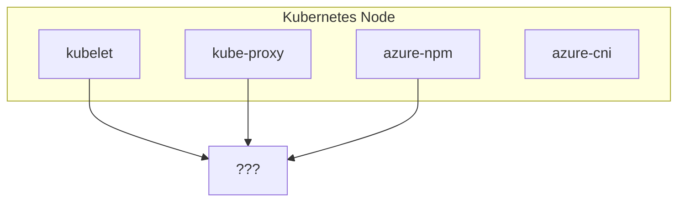

## Background

We run a self-hosted Kubernetes cluster on Azure with Azure Linux and Windows nodes. The networking stack uses [Azure CNI v1][azure-cni] for pod networking and IP allocation, and [Azure Network Policy Manager(NPM)][azure-npm] for network policy enforcement (similar role to Calico or Cilium's policy engines).



## Symptoms

Apart from azure-npm pods crashlooping on a few nodes, there were some errors in the logs.

These errors hint at where things went wrong:

```sh
error: There was an error running command: [iptables-nft -w 60 -L KUBE-KUBELET-CANARY -t mangle -n] Stderr: [exit status 1, # Warning: iptables-legacy tables present, use iptables-legacy to see them
iptables: No chain/target/match by that name.]
executing iptables command [iptables-legacy[] with args [-w 60 -L KUBE-KUBELET-CANARY -t mangle -n]
error: There was an error running command: [iptables-legacy -w 60 -L KUBE-IPTABLES-HINT -t mangle -n] Stderr: [exit status 1, iptables: No chain/target/match by that name.]
error: There was an error running command: [iptables-legacy -w 60 -L KUBE-KUBELET-CANARY -t mangle -n] Stderr: [exit status 1, iptables: No chain/target/match by that name.]

# and finally after few attempts
failed to detect iptables version: unable to locate which iptables version kube proxy is using
```

The code responsible for this logic is [in the azure-npm codebase on GitHub][azure-npm-code]. But I'd like to capture the gist of it for the context:



## How kubelet works with iptables

From the logs and azure-npm codebase, we found 2 important chains: `KUBE-IPTABLES-HINT` and `KUBE-KUBELET-CANARY`. Let's find out how those are created in the cluster. According to the documentation, both of those are actually populated by kubelet at *some* point of its lifecycle.

There is a very well-written [KEP-3178: Cleaning up IPTables Chain Ownership][kep-3178] that goes into the details of all chains that are created by kubelet, their purposes and their future in light of `dockershim` removal. Below is a short summary.

### KUBE-MARK-MASQ and KUBE-POSTROUTING

- `KUBE-MARK-MASQ` marks packets as needing to be masqueraded.
- `KUBE-POSTROUTING` checks the packet mark and calls -j MASQUERADE on the packets that were previously marked for masquerading. These chains were formerly used for HostPort handling in dockershim, but are no longer used by kubelet.

Kube-proxy (in iptables or ipvs mode) creates identical copies of both of these chains, which it uses for service handling.

### KUBE-MARK-DROP and KUBE-FIREWALL

- `KUBE-MARK-DROP` marks packets as needing to be dropped.
- `KUBE-FIREWALL` checks the packet mark and calls -j DROP on the packets that were previously marked for dropping. These chains have always been created by kubelet, but were only ever used by kube-proxy.

### KUBE-KUBELET-CANARY

- `KUBE-KUBELET-CANARY` is used by the `utiliptables.Monitor` functionality to notice when the `iptables` rules have been flushed and `kubelet` needs to recreate its rules.



### KUBE-IPTABLES-HINT

`KUBE-IPTABLES-HINT` chain is intended to be used as a hint to external components about which iptables API the system is using.

## Root Cause Analysis

Now it's time to figure out why `kubelet` hasn't created the required `iptables` rules.

```bash
I1008 05:38:38.192213    2825 kubelet_network_linux.go:58] "Failed to initialize iptables rules; some functionality may be missing." protocol="IPv4"
iptables v1.8.10 (nf_tables): Chain 'KUBE-FIREWALL' does not exist
Try `iptables -h' or 'iptables --help' for more information.
```

Initialization happens at `kubelet`'s startup, but this initial setup is not retriable. So once it fails, the `iptables` rules are missing. Note that kubelet does have ongoing recovery via `Monitor` — if the canary chain disappears later, it re-creates it. But if the very first initialization fails, there's no second chance.



The most mysterious part is what caused the failed initialization in the first place? Well, just like the meme:


Due to a rare race condition, `systemctl restart iptables` flushed all user-defined chains (including `KUBE-FIREWALL`) right as `kubelet` was trying to initialize its own. With no chains to reference, kubelet's init failed — and since it's a one-shot operation, the chains were never created.


## Fix

```bash
git show <fix_commit>

+iptables_save() {
+  info "Saving iptables"
   iptables-save > /etc/systemd/scripts/ip4save
   ip6tables-save > /etc/systemd/scripts/ip6save
-  systemctl restart iptables
 }
```

Why isn't it necessary to restart iptables?

`iptables-save` is a read-only operation — it snapshots the current in-kernel rules to a file on disk. This snapshot persists the `iptables` state and is used in case of node restart.

`systemctl restart iptables`, on the other hand, runs a stop script that calls `iptables -F` (flush all rules) and `iptables -X` (delete all user-defined chains), then a start script that restores rules from `/etc/systemd/scripts/ip4save`. Between stop and start, **all user-defined chains are gone**. This gap is exactly where `kubelet`'s init likely collided with the flush.

## Takeaways

- **Kubelet's iptables initialization is a one-shot operation.** If it fails on startup, the chains are never created. After the initial setup, kubelet's `Monitor` can recover lost chains — but only if the first init succeeded.
- **`systemctl restart iptables` is destructive.** The stop script runs `iptables -F && iptables -X`, deleting all user-defined chains. The restart is not atomic — there's a real gap between stop and start where chains don't exist.
- **iptables chains** still are [not API][iptables-chains-not-api]. Some parts of Kubernetes build on very fragile dependencies. This is a good example of how a simple feature can become a very vital dependency for the entire networking stack in the cluster.

[azure-npm-code]: https://github.com/Azure/azure-container-networking/blob/394517d6ccf17d3ffad57ba565624f3df6ecddae/npm/pkg/dataplane/policies/chain-management_linux.go#L252
[kep-3178]: https://github.com/kubernetes/enhancements/blob/master/keps/sig-network/3178-iptables-cleanup/README.md#external-users-of-kubelets-iptables-chains
[azure-cni]: https://github.com/Azure/azure-container-networking/blob/master/docs/cni.md
[azure-npm]: https://github.com/Azure/azure-container-networking/blob/master/docs/npm.md
[iptables-chains-not-api]: https://kubernetes.io/blog/2022/09/07/iptables-chains-not-api/
