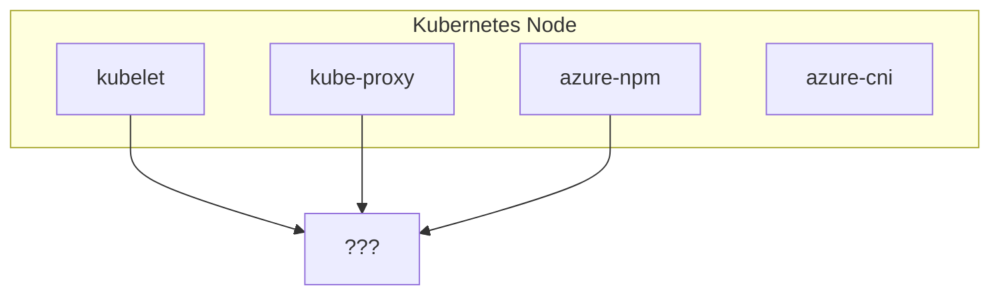
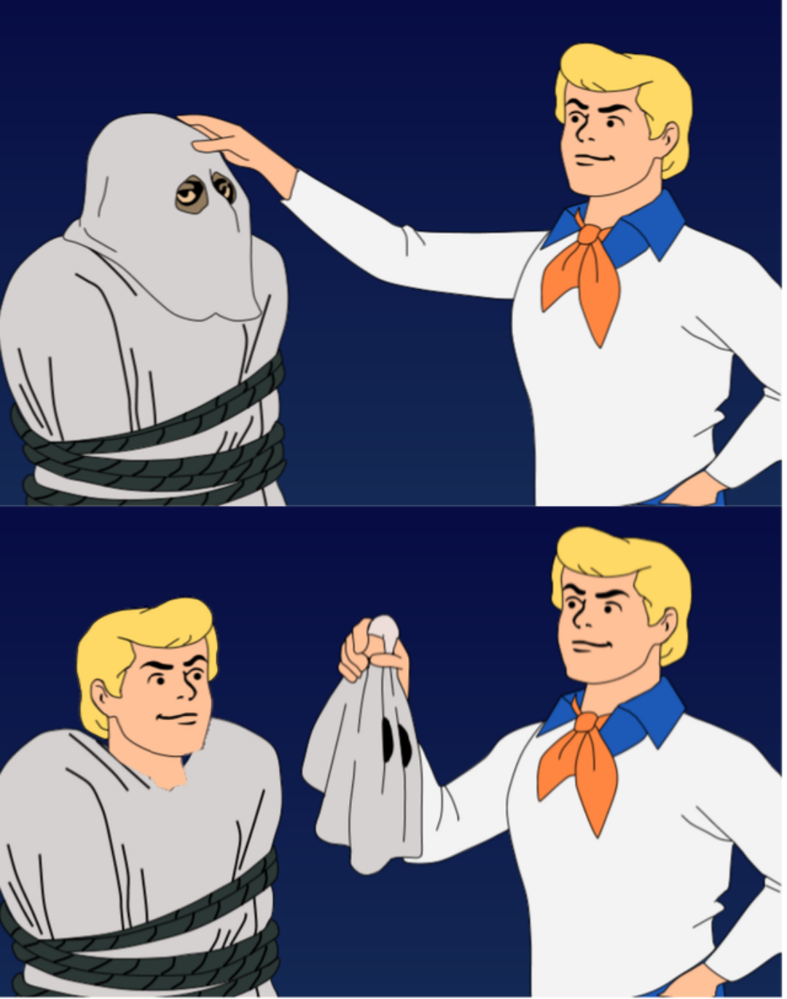
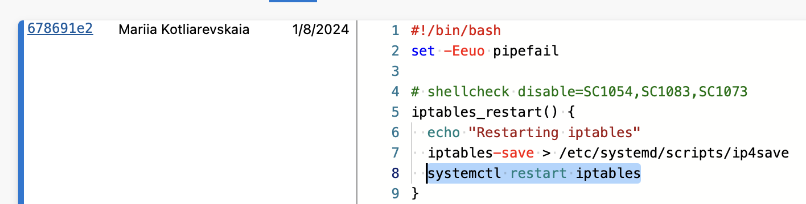

## Контекст

Типичный кластер платформы представляет собой ванильную инсталляцию Кубернетеса с рабочими нодами на Azure Linux и Windows Server. Сетевой уровень представлен [Azure CNI v1][azure-cni] для обеспечения сетевой связности между подами и аллокации IP адреса и [Azure NPM][azure-npm] для управления сетевыми политиками кластера (идентично аналогам от Calico и Cilium).



## Симптомы

В начале мы наблюдали CrashLoopBackOff статус на части Azure NPM подов в некоторых кластерах, в логах есть сообщения об ошибках инициализации плагина.

Эти ошибки дают нам идею, в каком направлении нужно продолжать траблшутинг.

```sh
error: There was an error running command: [iptables-nft -w 60 -L KUBE-KUBELET-CANARY -t mangle -n] Stderr: [exit status 1, # Warning: iptables-legacy tables present, use iptables-legacy to see them
iptables: No chain/target/match by that name.]
executing iptables command [iptables-legacy[] with args [-w 60 -L KUBE-KUBELET-CANARY -t mangle -n]
error: There was an error running command: [iptables-legacy -w 60 -L KUBE-IPTABLES-HINT -t mangle -n] Stderr: [exit status 1, iptables: No chain/target/match by that name.]
error: There was an error running command: [iptables-legacy -w 60 -L KUBE-KUBELET-CANARY -t mangle -n] Stderr: [exit status 1, iptables: No chain/target/match by that name.]

# и после нескольких попыток плагин сдается и завершается с ошибкой
failed to detect iptables version: unable to locate which iptables version kube proxy is using
```

На гитхабе можно быстро найти [кусок кода][azure-npm-code], который ответственен за логику инициализации. Ниже приведена основная суть:



## Как кублет работает с iptables

В логах Azure NPM упомянуты две цепочки `iptables`: `KUBE-IPTABLES-HINT` and `KUBE-KUBELET-CANARY`. Давайте разберемся, как они появляются на ноде. Согласно документации, обе создаются кублетом в *какой-то* момент.

На эту тему написан очень подробный [KEP-3178: Cleaning up IPTables Chain Ownership][kep-3178], который углубляется в историю, детали и будущие изменения всех цепочек, которыми управляет кублет.

### KUBE-MARK-MASQ и KUBE-POSTROUTING

`KUBE-MARK-MASQ` помечает пакеты для маскарадинга.

`KUBE-POSTROUTING` проверяет наличие отметки на пакетах и выполняет -j MASQUERADE, на пакетах отмеченных для маскарадинга. Эти цепочки раньше использовались для имплементации `HostPort` режима в `dockershim`, но после миграции больше не используются кублетом.

Куб-прокси (в режиме `iptables` или `ipvs`) создает копии этих цепочек для реализации логики управления объектами типа `Service`.

### KUBE-MARK-DROP и KUBE-FIREWALL

`KUBE-MARK-DROP` отмечает пакеты, которые должны быть отброшены.

`KUBE-FIREWALL` проверяет наличие отметки на пакетах и выполняет -j DROP, на пакетах отмеченных для дропа. Эти цепочки всегда создавались кублетом, но использовались только куб-прокси.

### KUBE-KUBELET-CANARY

`KUBE-KUBELET-CANARY` - это цепочка, которая используется `utiliptables.Monitor` для определения ситуации, когда `iptables` правила, созданные кублетом, были удалены или изменены. Если монитор обнаруживает, что эта цепочка была удалена, он считает, что все цепочки, которыми управляет кублет, были удалены и запускает процесс восстановления.



### KUBE-IPTABLES-HINT

`KUBE-IPTABLES-HINT` — это цепочка, которая используется как подсказка для определения версии `iptables`, которую использует куб-прокси.

## RCA

Теперь самое время выяснить, почему кублет не смог создать нужные правила.

В логах при старте кублета мы видим следующее информационное сообщение:

```bash
I1008 05:38:38.192213    2825 kubelet_network_linux.go:58] "Failed to initialize iptables rules; some functionality may be missing." protocol="IPv4"
iptables v1.8.10 (nf_tables): Chain 'KUBE-FIREWALL' does not exist
Try `iptables -h' or 'iptables --help' for more information.
```

Инициализация происходит при старте кублета и выполняется однократно (one-shot). Если она падает, кублет логирует ошибку и продолжает работать с ограниченной функциональностью — цепочки так и не создаются. `Monitor` умеет восстанавливать удаленные цепочки позже, но только если самая первая инициализация прошла успешно.



Самое непонятное — что изначально вызвало ошибку инициализации? Все как в меме:



Из-за редкого race condition, `systemctl restart iptables` сбросил все пользовательские цепочки (включая `KUBE-FIREWALL`) в тот момент, когда кублет пытался инициализировать свои. Так как в коде инициализации нет ретраев, эти цепочки так и не были созданы, и функциональность, которая от них зависит, сломалась.



## Чиним

```bash
git show <fix_commit>

+iptables_save() {
+  info "Saving iptables"
   iptables-save > /etc/systemd/scripts/ip4save
   ip6tables-save > /etc/systemd/scripts/ip6save
-  systemctl restart iptables
 }
```

Почему необязательно перезапускать iptables после применения изменений?

Операция `iptables-save` сохраняет текущее состояние правил в файл на диске. Этот снепшот позволяет восстановить правила после перезагрузки системы.

С другой стороны, `systemctl restart iptables` запускает процесс перезапуска, который вызывает `iptables -F` для очистки всех правил и цепочек, потом `iptables -X` для удаления всех пользовательских цепочек, и только после этого выполняет `iptables-restore` для загрузки правил из сохраненного файла.

## Выводы

- **Инициализация iptables в кублете — это одноразовая операция (one-shot).** Если она падает при старте, цепочки так и не создаются. После успешной инициализации `Monitor` кублета умеет восстанавливать потерянные цепочки — но только если самая первая инициализация прошла успешно.
- **`systemctl restart iptables` — деструктивная операция.** Stop-скрипт выполняет `iptables -F && iptables -X`, удаляя все пользовательские цепочки. Перезапуск не атомарен — между остановкой и запуском есть реальный промежуток времени, когда цепочек не существует.
- **Цепочки iptables всё ещё [не API][iptables-chains-not-api].** Некоторые части Кубернетеса построены на очень хрупких зависимостях. Это хороший пример того, как простая функциональность может стать критически важной зависимостью для всего сетевого стека в кластере.

[azure-npm-code]: https://github.com/Azure/azure-container-networking/blob/394517d6ccf17d3ffad57ba565624f3df6ecddae/npm/pkg/dataplane/policies/chain-management_linux.go#L252
[kep-3178]: https://github.com/kubernetes/enhancements/blob/master/keps/sig-network/3178-iptables-cleanup/README.md#external-users-of-kubelets-iptables-chains
[azure-cni]: https://github.com/Azure/azure-container-networking/blob/master/docs/cni.md
[azure-npm]: https://github.com/Azure/azure-container-networking/blob/master/docs/npm.md
[iptables-chains-not-api]: https://kubernetes.io/blog/2022/09/07/iptables-chains-not-api/
