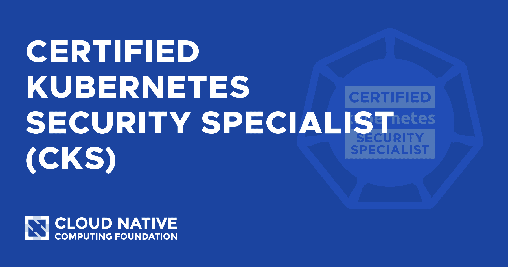

По горячим следам решила написать заметку по сдаче CKS в 2022 году. В большинстве своем будет также актуально и для CKA/CKAD.

## Процесс подготовки

Для CKS рекомендую сконцентрироваться на практике и заполнении пробелов.

* [бесплатные мини-таски](https://killercoda.com/killer-shell-cks)
* обязательно используйте 2 mock-exam, которые вам доступны при покупке сертификации (авторизация через LinuxFoundation)
* по курсам могу советовать курс из [KodeKloud](https://kodekloud.com/courses/certified-kubernetes-security-specialist-cks/), категорически не советую курс с [Udemy](https://www.udemy.com/course/certified-kubernetes-security-specialist/)
* [шпаргалка с примерами заданий](https://drive.google.com/file/d/1Ok09giAi_xAUx_TRULQAhjj10Y8xGFri/view?usp=sharing) и их решениями
* пооткрывайте список разрешенных ссылок и посмотрите список разделов, чтобы сэкономить время на экзамене
* почитайте [документацию к ETCD](https://etcd.io/docs/v3.5/op-guide/configuration/), она находится на отдельном сайте и в документации Kubernetes выдержек из нее практически нет

## Процесс верификации

* Убедитесь в стабильности Интернета, у меня была средняя скорость порядка `>100mb/s`, никаких проблем во время экзамена не было
* Уберите всю ненужную электронику из помещения, нужно оставить смартфон, стакан воды и id (внж, паспорт и тд)
* Все инструкции вам будут присылать через чат - в целом все просто, показывайте комнату в указанном порядке и убираете телефон так, чтобы он был вне зоны доступа
* Если у вас Macbook, заранее отключите на всех домашних устройствах Bluetooth & Airdrop, так как перед экзаменом придется пройти автоматические проверки для закрытия всех неразрешенных приложений, в т.ч. системных.

## Процесс сдачи

Я использовала простую стратегию - максимально нарешать все быстрые и легкие задания и в остаток времени сконцентрироваться на тех, которые знаю как делать и которые весят больше всего. Вес всех заданий указан в процентах.
Примерные тайминги: 1 час 20 минут было потрачено на основную часть, в оставшееся время разбиралась с 4мя заданиями, которые не получилось сделать сразу. Итого, закрыла еще 2.

### Tips & tricks

* если нужно совершать много манипуляций с файлом - используйте `Mousepad` и копируйте итоговый файл через `vim`
* список разрешенных ресурсов будет доступен во время экзамена - ссылки можно просто копировать в браузер
* во время экзамена я использовала мышку мне показалось удобнее, особенно когда подлагивало копирование-вставка + можно довольно быстро скроллить колесиком.
* экономьте время и пропускайте задания, которые не знаете. После того, как сделаете основные - сможете спокойно вернуться к отложенным(предварительно помечайте их флажком). Сможете лучше сконцентрироваться на их выполнения, зная, что вся остальная часть уже готова
* делайте бекапы конфигураций `kube-apiserver` & `etcd`, пригодятся для быстрого роллбека
* в некоторых заданиях связанных с `kube-apiserver` может быть необходимо также изменить конфигурацию `kubelet`
* всегда выполняйте команду на смену контекста для кластера
