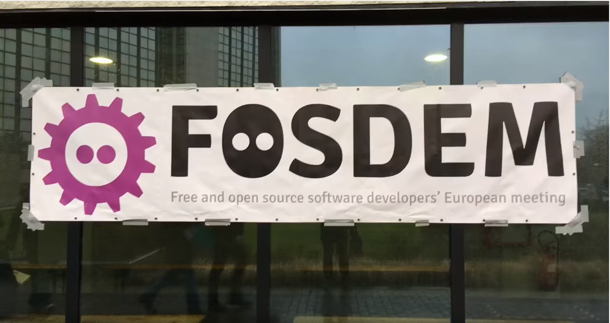

Этот год начался с конференции Fosdem в Брюсселе. Я ехала с основной целью - послушать технические доклады из аудиторий Go и Monitoring & Observability. По итогам решила написать небольшую заметку, которая поможет посмотреть самые удачные на мой взгляд доклады из этих секций (и парочки других).

Легенда:

👀 - смотреть

📚 - читать

## Go room

[👀 The State of Go](https://fosdem.org/2023/schedule/event/gostateofgo/)

- a more convenient way to convert a slice to an array
- improvements to generics - comparison
- toolchain improvements - introduced new commands, improved go vet
- changes in the standard library - error(multiple errors wrapping), time, bytes & strings
- Go future: Go 2.0 and drafts - structured logging, go version compatibility (metrics)

[👀 Recipes for reducing cognitive load](https://fosdem.org/2023/schedule/event/goreducecognitive/)

- line of sight
- better errors
- pure functions
- mysterious booleans
- package splitting, public objects on the top

[📚 Building a CI pipeline with Dagger in Go](https://fosdem.org/2023/schedule/event/gocidagger/)

- Dagger has few SDKs available: Go, Python, etc.
- Makefile for Go - [mage](https://github.com/magefile/mage)
- write pipelines with Go, use all benefits of the language
- supported container runtime - docker 🙄 

[📚 Debugging concurrency programs in Go](https://fosdem.org/2023/schedule/event/godebugconcurrency/)

- [colored output](https://github.com/xiegeo/coloredgoroutine)
- debuggers - delve, gdb
- profile labels, goroutines labels
- debugger middleware

[📚 Optimizing string usage in Go programs](https://fosdem.org/2023/schedule/event/gooptimizingstrings/)

3 things:

- understanding go strings behind the scenes
- string use cases prone to performance bottlenecks
- optimization strategies:
  - detaching strings from larger memory pools
  - string interning
  - string interning with symbol table
  - string concatenation

[👀 Squeezing a go function](https://fosdem.org/2023/schedule/event/gosqueezingfunction/)

- benchmarks
- profiling
- reducing CPU usage
- reducing allocations
- packing
- function inlining
- escape analysis
- concurrency

[👀 Five Steps to Make Your Go Code Faster & More Efficient](https://fosdem.org/2023/schedule/event/gofivestepsefficient/)

- Use Test Fix Benchmark Optimize
- Understand current efficiency level (micro-benchmarks)
- Understand your efficiency requirements
- Do profiling
- Try to optimize and repeat

[👀 Our Mad Journey of Building a Vector Database in Go](https://fosdem.org/2023/schedule/event/gobuildingdatabase/)

- memory allocations are important for high-performance applications
  - binary.Read() isn't optimal
  - **stack** is short-lived, fast, and chip, heap is long-lived, **expensive** and slower
  - `binary.LittleEndian.Uint32` allows reading without memory allocations
- delayed decoding
  - json is too slow
  - binary encoding is fast, but decoding everything up-front is still expensive
  - replace allocation with summing up
  - in Go 1.20 experimental support for memory arena that potentially can be used to bypass the GC
- SIMD (single instruction, multiple data)
  - assembly allows to do it
  - there is no way to write explicit SIMD instructions in pure Go
  - [avo](https://github.com/mmcloughlin/avo) allows to generate x86 assembly

[👀 Building a basic event-driven application in Go in 20 minutes. Introduction to Watermill](https://fosdem.org/2023/schedule/event/gowatermill/)

- watermill allows simplifying writing event-driven apps
- provides an easy way to test things
- https://threedots.tech/fosdem2023/

## Monitoring & Observability

[📚 Monitor your databases with Open Source tools](https://fosdem.org/2023/schedule/event/db/)

- [PMM](https://docs.percona.com/percona-monitoring-and-management/index.html) - various DB(postgres, mysql, mongodb) monitoring, query monitoring

[👀 Observability in Postgres](https://fosdem.org/2023/schedule/event/postgres/)

- a lot of useful data in the internal DBs
- there is a prometheus-exporter with support for custom queries
- it has issues e.g. performance, no metrics if running out of max_connections, ...
- can be improved by Postgres itself by introducing support for monitoring via a port. 

[👀 Loki: Logging, but make it cloud native](https://fosdem.org/2023/schedule/event/loki/)

[👀 Adopting continuous-profiling](https://fosdem.org/2023/schedule/event/profiling/)

- interesting approach to have observability to debug high-performance applications
- [Phlare](https://grafana.com/oss/phlare/) is a Grafana open-source solution (other: pixie, parca, pyroscope)

[👀 Inspektor Gadget: An eBPF-based Tool to Observe Containers](https://fosdem.org/2023/schedule/event/ebpf/)

- cool tool for debugging via eBPF
- supports local and Kubernetes installation

## Other rooms

[📚 Automating secret rotation in Kubernetes](https://fosdem.org/2023/schedule/event/container_kubernetes_secret_rotation/)

- External secrets operator + Reloader = semi/automatic secret rotation

[👀 How We Gained Observability Into Our CI/CD Pipeline](https://fosdem.org/2023/schedule/event/how_we_gained_observability_into_our_cicd_pipeline/)

- Configure open telemetry plugin for Jenkins to collect traces
- push metrics via Telegraph and visualize them in Grafana
- [Article](https://logz.io/learn/cicd-observability-jenkins/) about it

[👀 Tour de Data Types: VARCHAR2 or CHAR(255)?](https://fosdem.org/2023/schedule/event/postgresql_tour_de_data_types_varchar2_or_char_255/)

- About data types in Postgres (there are many!)

[👀 Don't Do This](https://fosdem.org/2023/schedule/event/postgresql_dont_do_this/)

- Correct types for data storage
- (Sub-)Partitioning
  - And how to get it wrong
- Bad SQL habits
- Table inheritance
  - And how to undo it
- Security issues
  - Unsafe configurations and usage
- Connections
  - Number of, and properly handling

[👀 7 years of cgroup v2: the future of Linux resource control](https://fosdem.org/2023/schedule/event/container_cgroup_v2/)
