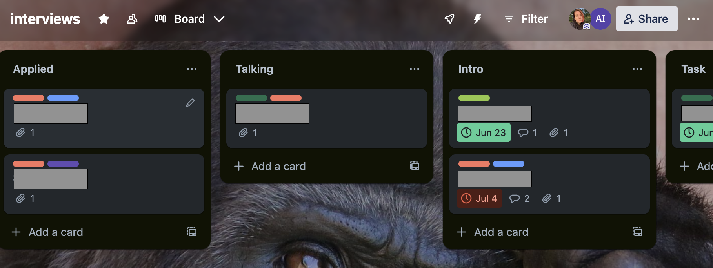
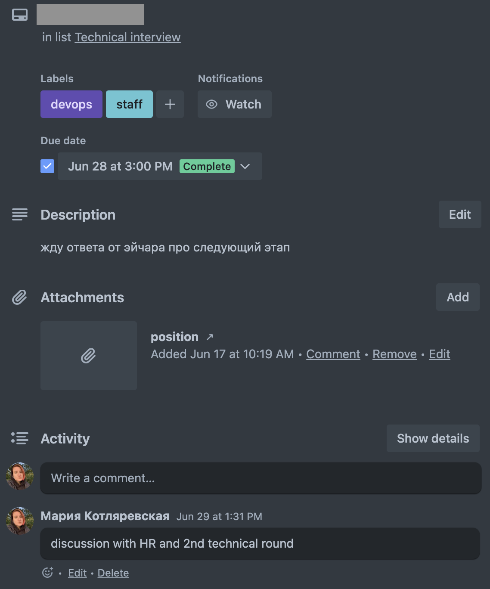
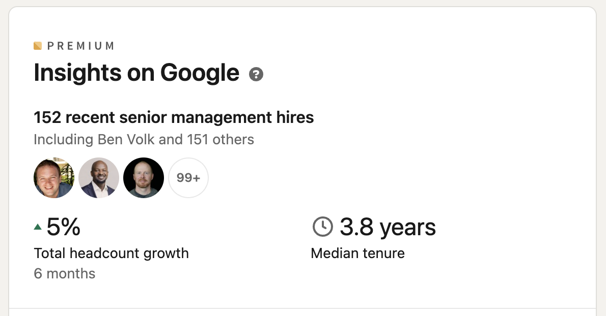

## Контекст

Этим летом я приняла решение сменить работу. Поэтому в этом посте я расскажу о своем опыте и поделюсь ресурсами, которые помогли мне подготовиться к собеседованиям и получить оффер.

## Процесс

Процесс интервью обычно состоит из нескольких этапов, они могут меняться в зависимости от позиции, на которую вы собеседуетесь. Обычно, HR рассказывает о всех этапах во время интро или первого звонка. 
Ниже я приведу примерный список этапов, которые я встречала и проходила:
- скрининг с HR
- проверки технических скиллов
- интервью с менеджером
- стадия оффера

## Подготовка

До начала процесса интервью я:
- сделала резюме в Google Docs и обновила профиль на LinkedIn. Резюме в Google Docs можно легко конвертировать в разные форматы по запросу HR.
- включила LinkedIn Premium(первый месяц бесплатно)
- подготовила трелло доску, где буду отслеживать процесс интервью

- как только я находила интересующую меня вакансию, я добавляла ее в трелло доску. В карточке я обязательно добавляла имя компании, ссылку на позицию и теги, например - `devops`, `sre`, `senior`, `remote only`  и тд. 

## Скрининг с HR

Во время скрининга у нас есть несколько целей:
- презентовать себя и понравиться HR
- понять, подходит ли нам компания
- в ходе разговора узнать больше о позиции и компании и отметить наличие red/yellow/green flags

### До

- гуглим компанию, читаем отзывы на Glassdoor, смотрим LinkedIn компании (вдруг у нас там есть знакомые) + можно посмотреть как менялся headcount в последнее время

- смотрим описание позиции, отмечаем вопросы, которые хотим задать

### Во время

- готовимся рассказать о себе и своем опыте в 3-5 предложениях, упомянув ключевые позиции, технологии и ваши зоны ответственности в команде и проектах
- задаем вопросы
- спрашиваем, когда HR вернется к нам с фидбеком

### После

- добавляем в трелло карточку с вакансией
- если HR не вернулся к нам с фидбеком, то пишем ему напоминание через несколько дней после дедлайна (если он был)

## Техническое интервью

С ними бывают разные приколы, такие как:
- короткий созвон с рядом вопросов, по результатам которых тебя ОКнут или реджекнут(=откажут)
- тестовое задание
- технические собесы в нескольких частях (в среднем 1-2, бывает и больше в зависимости от компании и роли)
- практические задания - программирование (white board, leetcode и подобные), систем дизайн, траблшутинг

### До

Во время подготовки я просматривала стандартные темы для позиций DevOps / SRE / Platform инженеров: Linux, сети, DNS, TLS  и тд. Ниже я приведу список ресурсов, которые мне помогли.
- [Флеш-карточки](https://flashcards.wizardzines.com/) от Julia Evans 
  Сгруппированны по разным темам (Linux, DNS, TLS, HTTP, Container basics), удобно для быстрого повторения
- [SRE interview preparation guide](https://github.com/mxssl/sre-interview-prep-guide) 
  Подробный чеклист для подготовки, ориентированный на SRE. Ресурсы разбиты по топикам, поэтому пригодится большинству инженеров в области инфрастуктуры, девопс и поддержки
- [DevOps exercises](https://github.com/bregman-arie/devops-exercises/tree/master)
  Хороший репозиторий для быстрого восполнения пробелов. В основном использую разделы связанные с Linux и сетями
- [Awesome System Design](https://github.com/madd86/awesome-system-design)
  Репозиторий, в котором можно найти материалы по подготовке к System Design
- [Youtube канал](https://www.youtube.com/@tryexponent) с записями прохождений System Design интервью различной сложности и на различные позиции

### Во время
- Стараемся отвечать на конкретно поставленные вопросы
- Если вопрос не ясен, лучше уточнить у собеседующего контекст или задать вопросы, которые помогут нам понять, что от нас хотят
- Если мы не знаем ответа, то лучше сказать об этом, чем пытаться выдать неправильный ответ
- Если интервьюер предлагает помочь в поиске ответа, то пользуемся этим
- В конце секции часто оставляют время для вопросов. Я обязательно использую эту возможность, чтобы получить честный фидбек, так как инженеры обычно прямолинейны и говорят, как есть. Поэтому здесь можно спрашивать о вещах, которые важны именно тебе. Мой топ вопросов:
    - Что тебе больше всего нравится в твоей работе/команде/компании?
    - Из чего состоит твой обычный день или неделя?
    - Если бы ты мог поменять несколько вещей в своей работе/команде/компании, что бы это было?

### После

Сразу после собеседования я отмечаю вопросы, на которые не ответила и добавляю их в список для повторения. Это полезно для саморефлексии и конечно для будущих интервью. Если у меня есть новая информация, то также я дополняю карточку в Trello. 

## Интервью с менеджером

Такие интервью могут проходить в разных форматах, начиная от простого диалога про карьерные цели и профессиональный бекграунд, так и могут включать ситуационные вопросы.

Я встречала также названия Cultural fit / Behavioral interview. По идее это все плюс-минус одно и тоже.

### До

Лучше всего подготовить список достижений и проектов, на которыми вы работали последние несколько лет. Рекомендую сфокусироваться на вашей зоне ответственности и рассказать о том, как именно вы и ваш вклад в проект помогли достичь цели.

Также я отобрала список вопросов и написала на них ответы по методу STAR (Situation, Task, Action, Result). Это помогает структурировать ответ и не забыть упомянуть важные детали. Вдохновляться можно из открытых источников, например в отзывах Glassdoor часто встречаются конкретные вопросы.

Список вопросов может быть таким:
1. Расскажи о ситуации, когда ты придумал интересное решение для проблемы
2. Чтобы ты хотел найти в своей следующей работе?
3. Расскажи мне о ситуации, когда ты пропустил очевидное решение для проблемы
4. Расскажи мне о ситуации, когда ты не смог достичь цели до установленного дедлайна. Что помешало тебе? Какой был результат и какие уроки ты извлек из этого опыта?
5. Опиши долгосрочный проект, на которым ты работал. Что ты делал, чтобы обеспечивать постоянный прогресс и соблюдение сроков?

### Во время

Во время собеседования будь самим собой и старайся давать структурированные ответы. Если вопрос задан неоднозначно - лучше не торопиться с ответом и уточнить у собеседника, что именно он имеет ввиду. Это даст нам время подумать и сформулировать ответ.

Здесь нам важно показать, что мы умеем работать в команде, умеем общаться и решать проблемы. Также важно показать, что мы можем быть лидерами и вести проекты от идеи до реализации в заданные сроки.

В рамках секции с вопросами рекомендую спрашивать про возможности роста и развития внутри команды/компании, какая у них система уровней, с какими командами нужно взаимодействовать и как происходит процесс перформанс ревью. Такие вопросы помогут показать, что мы заинтересованы в развитии и готовы работать над собой.

### После

Фиксируем вопросы и пишем подробные ответы, рефлексируем над тем, как прошло интервью и что можно улучшить.

## Стадия оффера

Если нас реджектнули - благодарим за время и возможность.

Если мы реджектнули - благодарим за то, что предоставили нам такую возможность и говорим, что решили принять оффер другой компании.

Если нам нравятся несколько компаний и мы хотим получить более приятные офферы (деньги, бонусы, релокация), то можно начать переговоры. 

Мой ресерч [показал](https://interviewing.io/blog/sabotage-salary-negotiation-before-even-start), что лучше избегать называть имена компаний, конкретные цифры и даты. Лучше говорить о том, что мы хотим получить и почему. Например, мы хотим получить больше денег, потому что у нас есть семья и мы хотим обеспечить им хорошие условия жизни. 

Если у оффера есть дедлайн, а мы хотим получить оффер от другой компании, то можно попросить HR продлить дедлайн.
> Я бы хотела принять взвешенное решение и обсудить оффер с моей семьей/партнером. Я была бы благодарна, если бы вы могли продлить дедлайн до <дата>.

> I want to make an informed decision and discuss offer with my family/partner/significant other. I would really appreciate if you could extend the deadline for me.

- [Хорошая статья](https://interviewing.io/blog/negotiate-salary-recruiter) о том, что говорить, когда эйчары спрашивают про конкретные цифры
- [10 правил переговоров по офферу](https://haseebq.com/my-ten-rules-for-negotiating-a-job-offer/)

## Общие ресурсы 

Эти ресурсы пригодились мне, чтобы более уверенно проходить через этапы:

- Must-watch [видео](https://youtu.be/NjOjMb4ECAw) про то, как вести себя во время собеседования, (не)отвечать на вопросы и грамотно выстраивать диалог.
- [О чем можно спрашивать](https://askabout.company/) HR / собеседующих / бущущих тиммейтов и менеджеров
- [Актуальная история](https://vas3k.club/post/20213/) о том, как проходит процесс найма в 2023
- [Большая подборка ресурсов](https://faang-interview.github.io/) для подготовки к собеседованиям в FAANG
- [Плейлист по подготовке к собеседованиям](https://www.youtube.com/watch?v=0Z9RW_hhUT4&list=PLz1XguJFqmKoo7b8xdDQjH1OH_xwn9Y7n)
